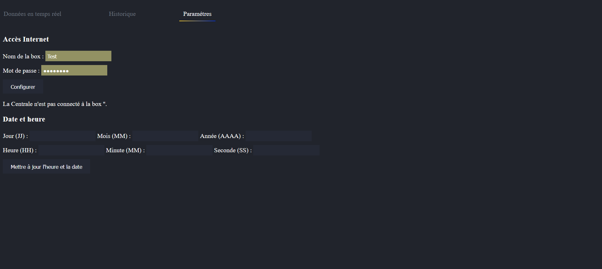
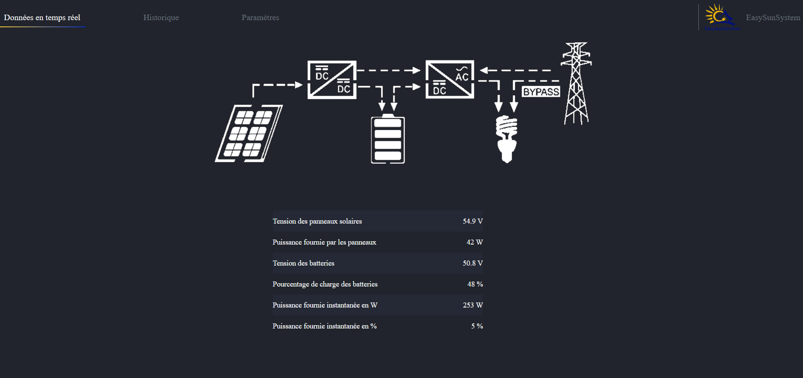
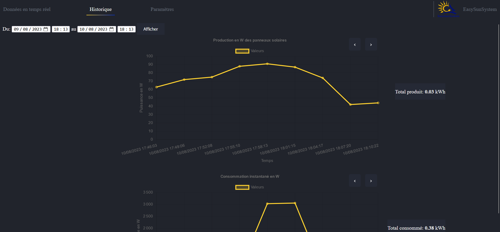

# EasySunSystem 🌞

## 🚀 Overview

This project provides **access to the production data of an EasySunSystem solar power plant** via a **Wi-Fi web interface**.  
The system runs on a **Raspberry Pi** connected to the inverter through Modbus (RS485) and serves a local web page accessible from any browser.

---

## 📸 Web Interface Overview

Monitoring page for production, consumption, and system settings:

  
  


---

## ⚙️ Raspberry Pi Configuration

### 1. Auto-start the Application

Create the following file:  
`/etc/systemd/system/easy_sun.service`

```ini
[Unit]
Description=Easy Sun System
After=multi-user.target

[Service]
Type=idle
Environment=PYTHONPATH=/home/easysun/.local/lib/python3.9/site-packages
ExecStart=/usr/bin/python3 /home/easy/Documents/EasySunSystem/app_l.py

[Install]
WantedBy=multi-user.target
```

**Useful commands:**

```bash
sudo systemctl enable easy_sun.service      # Enable on startup
sudo systemctl start easy_sun.service       # Start the service now
sudo systemctl status easy_sun.service      # Check the status
sudo systemctl stop easy_sun.service        # Stop the service
sudo systemctl daemon-reload                # Reload services
```

---

## 📡 Wi-Fi Hotspot Configuration

### 1. Auto-start the Hotspot Service

Create the following file:  
`/etc/systemd/system/wifi-hotspot.service`

```ini
[Unit]
Description=Wi-Fi Hotspot Service
After=network.target

[Service]
ExecStartPre=/usr/sbin/service dnsmasq restart
ExecStart=/usr/sbin/service hostapd restart
Type=oneshot
RemainAfterExit=yes

[Install]
WantedBy=multi-user.target
```

Enable the service:

```bash
sudo systemctl enable wifi-hotspot.service
```

### 2. `hostapd.conf` Configuration

```ini
interface=wlan0
ssid=MyWiFiHotspot
hw_mode=g
channel=7
wpa=2
wpa_passphrase=MyPassword
wpa_key_mgmt=WPA-PSK
address=192.168.4.1
netmask=255.255.255.0
```

### 3. `wpa_supplicant.conf` Configuration (to connect to an existing Wi-Fi network)

```ini
network={
    ssid="NetworkName"
    psk="NetworkPassword"
}
```

### 4. `dhcpcd.conf` Configuration (static IP address for the hotspot)

```ini
interface=wlan0
static ip_address=192.168.4.1/24
nohook wpa_supplicant
```

---

## 🌐 How to Connect to the Web Interface

### Step 1: Connect to the Plant’s Wi-Fi Network

1. Open your device’s Wi-Fi settings.
2. Look for the network named:  
   **`CentraleEasySunSystem`**
3. Enter the password:  
   **`easysunsystem`**

---

### Step 2: Access the Dashboard

1. Open a web browser (Chrome, Firefox, etc.).
2. Enter the following address in the URL bar:  
   👉 [http://192.168.0.254:5000](http://192.168.0.254:5000)

---

## 📬 Contact

Author: **Théo de Morais**  
Creation date: **August 10, 2023**

## 🌟 License
