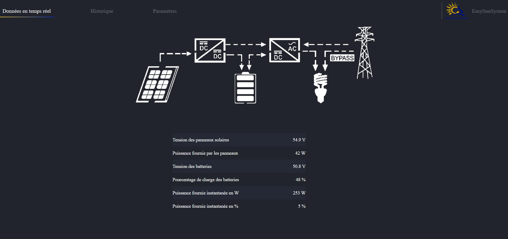

# EasySunSystem

Monitoring d'une centrale solaire EasySunSystem via une interface web sur Raspberry Pi.

Le systeme lit les donnees de l'onduleur en Modbus (RS485), les stocke en SQLite, et sert une interface web accessible depuis n'importe quel navigateur.





---

## Demarrage rapide (sans materiel)

Le mode simulation permet de tester l'application sans etre connecte a une centrale :

```bash
# Installer les dependances
pip install -r requirements.txt

# Lancer en mode simulation
python app.py --simulate -p 5000
```

Ouvrir http://localhost:5000 dans le navigateur. 3 jours de donnees simulees sont pre-generees au demarrage (courbe solaire realiste, consommation variable, charge/decharge batterie).

Options :
```bash
python app.py --simulate -p 5000     # Mode simulation, port 5000 (dev local)
python app.py --simulate             # Mode simulation, port 80 (necessite sudo)
python app.py                        # Mode reel (Raspberry Pi, connexion Modbus)
```

---

## Installation sur Raspberry Pi

### Materiel necessaire

- Raspberry Pi 3B+ ou plus recent (WiFi integre)
- Adaptateur USB vers RS485
- Cable RS485 vers l'onduleur
- Alimentation Raspberry Pi
- Carte microSD (8 Go minimum)

### Etape 1 : Preparer la carte SD

1. Telecharger [Raspberry Pi Imager](https://www.raspberrypi.com/software/)
2. Flasher **Raspberry Pi OS Lite (64-bit)** sur la carte SD
3. Dans les parametres avances de l'imager, activer le SSH et configurer un mot de passe

### Etape 2 : Installer le projet

Connecter le RPi en Ethernet (ou en SSH via le reseau local) puis :

```bash
# Cloner le projet
git clone https://github.com/votre-repo/easy_sun_system.git
cd easy_sun_system

# Lancer l'installation automatique
sudo bash setup_rpi.sh
```

Le script `setup_rpi.sh` fait tout automatiquement :
- Met a jour le systeme
- Installe hostapd, dnsmasq, et les dependances Python
- Configure le hotspot WiFi (SSID: **EasySunSystem**)
- Configure le portail captif (redirection automatique)
- Active les services systemd pour le demarrage automatique
- Redemarre le RPi

### Etape 3 : Branchements

1. Brancher l'adaptateur USB-RS485 sur le Raspberry Pi
2. Connecter le cable RS485 entre l'adaptateur et le port Modbus de l'onduleur
3. Alimenter le Raspberry Pi

Le systeme demarre automatiquement.

---

## Premiere connexion

### 1. Se connecter au WiFi de la centrale

Depuis un telephone ou un ordinateur :

| | |
|---|---|
| **Reseau WiFi** | `EasySunSystem` |
| **Mot de passe** | `easysunsystem` |

### 2. Acceder a l'interface

Une popup **"Se connecter au reseau"** apparait automatiquement sur le telephone. Elle ouvre directement l'interface de monitoring.

Si la popup n'apparait pas, ouvrir n'importe quel site dans le navigateur (ex: google.com). La redirection est automatique.

En dernier recours, aller a : `http://192.168.0.254`

### 3. Configurer le WiFi de la box (optionnel)

Pour acceder a l'interface depuis votre reseau domestique :

1. Aller dans l'onglet **Parametres**
2. Entrer le nom et le mot de passe de votre box internet
3. Cliquer sur **Configurer**
4. Le Raspberry Pi se connectera a votre box au prochain redemarrage
5. L'adresse IP sur votre reseau s'affichera dans la page Parametres

---

## Interface web

### Temps reel

Affiche les donnees en direct de la centrale :
- Tension des panneaux solaires (V)
- Puissance solaire (W)
- Tension et charge batterie (V / %)
- Puissance consommee (W)

Les donnees se rafraichissent toutes les 30 secondes.

### Historique

Graphiques de production et consommation sur une periode choisie :
- Selecteur de dates (debut / fin)
- Zoom et navigation dans les graphiques
- Total produit et consomme en kWh

Les donnees sont enregistrees toutes les 3 minutes et conservees pendant 1 an.

### Parametres

- Configuration WiFi de la box internet
- Mise a jour de la date et l'heure du systeme
- Effacement des donnees historiques

---

## Architecture du projet

```
easy_sun_system/
  app.py                    # Point d'entree (--simulate pour le mode simulation)
  config.py                 # Configuration centralisee
  setup_rpi.sh              # Script d'installation Raspberry Pi
  requirements.txt          # Dependances Python
  easysun/
    __init__.py             # App factory Flask
    routes/
      pages.py              # Pages HTML (dashboard, historique, parametres)
      api.py                # API JSON (donnees temps reel, graphiques)
      system.py             # API systeme (WiFi, heure, donnees)
    services/
      reader.py             # Interface abstraite (reel / simulation)
      modbus_service.py     # Communication Modbus RS485
      simulator.py          # Simulation solaire realiste
    database/
      db.py                 # Gestion connexions SQLite
      repository.py         # Sauvegarde, requetes, calcul energie
    models/
      registers.py          # Mapping des registres Modbus
    utils/
      validation.py         # Validation des entrees utilisateur
      network.py            # Configuration WiFi, detection IP
    tasks/
      scheduler.py          # Taches de fond (sauvegarde, nettoyage)
  templates/                # Templates HTML Jinja2
  static/
    css/main.css            # Styles (dark theme, responsive)
    js/                     # JavaScript (vanilla, sans jQuery)
    vendor/                 # Chart.js
  config/                   # Fichiers de configuration Raspberry Pi
  tests/                    # Tests unitaires (pytest)
```

---

## Developpement

### Lancer les tests

```bash
python -m pytest tests/ -v
```

### Variables d'environnement

| Variable | Description | Defaut |
|----------|-------------|--------|
| `EASYSUN_SIMULATION` | Mode simulation (`true`/`false`) | `false` |
| `EASYSUN_MODBUS_PORT` | Port serie Modbus | `/dev/ttyUSB0` |
| `EASYSUN_SLAVE_ADDR` | Adresse esclave Modbus | `4` |
| `EASYSUN_BAUDRATE` | Vitesse Modbus | `19200` |
| `EASYSUN_PORT` | Port du serveur web | `80` |
| `EASYSUN_SAVE_INTERVAL` | Intervalle de sauvegarde (secondes) | `180` |
| `EASYSUN_RETENTION_DAYS` | Duree de retention des donnees (jours) | `365` |

### Commandes systemd utiles

```bash
sudo systemctl status easy_sun.service      # Statut de l'application
sudo systemctl restart easy_sun.service     # Redemarrer l'application
sudo systemctl stop easy_sun.service        # Arreter l'application
journalctl -u easy_sun.service -f           # Voir les logs en direct
```

---

## Contact

Auteur : **Theo de Morais**
Creation : Aout 2023
